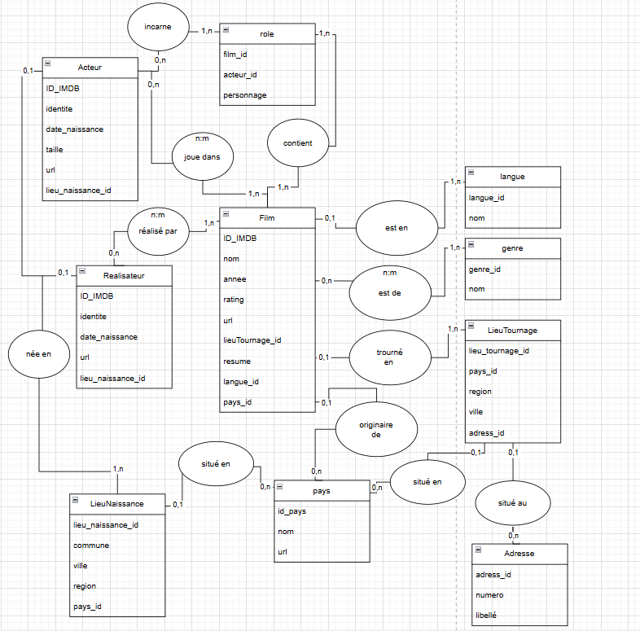
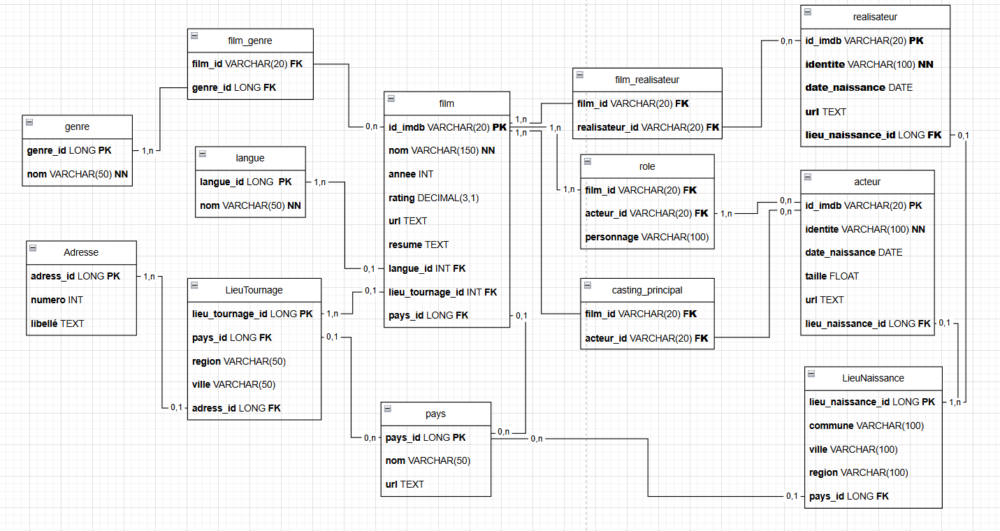

# 🎬 Projet JPA - IMDB

Ce projet a pour objectif la conception et le développement d’une application Java permettant de mettre en base de données les informations provenant du site IMDB.  
Les données concernent 2748 films, 44 500 acteurs et actrices, ainsi que des informations complémentaires comme les lieux de naissance, les genres de films, les réalisateurs, les lieux de tournage, etc.

---

## Données utilisées

Les données sont fournies sous forme de fichiers CSV :

1. `films.csv` : liste des films
2. `acteurs.csv` : liste des acteurs
3. `realisateurs.csv` : liste des réalisateurs
4. `roles.csv` : rôles joués par les acteurs dans les films
5. `film_realisateurs.csv` : correspondances entre films et réalisateurs
6. `pays.csv` : liste des pays

---

## Contraintes techniques

- **Lieu de naissance, pays, langue, genre** doivent être des classes dédiées (pas des `String`)
- **Identifiants uniques** pour chaque entité
- Les entités doivent être **uniques** (lieux, pays, langues, genres)
- Les **dates de naissance** doivent être en `DATE` dans la base de données
- **Pas de Lombok**
- **Pas de Cascade** (gestion manuelle recommandée)
- Traitement **re-exécutable** (vérifier l’existence avant insertion)
- Gestion des erreurs (ligne invalide → log ou table des erreurs)

---

## Étapes du projet

### 1. Conception

- Création des modèles MCD / MPD
- Dossier `/conception` contenant ces éléments (images incluses)

  ## Modèle Conceptuel de Données (MCD)



  ## Modèle Physique de Données (MPD)


### 2. Configuration du projet Maven

- Création du projet avec l’archetype `quickstart`
- Fichier `persistence.xml` configuré avec la BDD MySQL
- Dépendances ajoutées :
    - Hibernate Core
    - Jakarta Persistence API
    - MySQL Connector

### 3. 💡 Développement de l'application

- Mise en place des **entités JPA** avec annotations
- **Découpage en couches** :
    - `abstract class` :  afin d’éviter la duplication de code et d’appliquer les principes de clean code
    - `dao` : accès à la base (une DAO par entité)
    - `service` : logique métier
    - `utils` : classes utilitaires : Pour la transformation des données.
    - `factory` : implémentation du pattern Factory
- Traitement robuste :
    - Normalisation des dates (formats variés)
    - Traitement des lieux complexes (ville/pays, ville/état/pays, etc.)
    - Verification des doublons.
- Javadoc générée sur les classes et méthodes

## 📁 Structure du projet

```bash

jpa-project/
│
├── src/
│   └── main/
│       ├── java/
│       │   ├── AbstractClass/          # Classes génériques abstraites
│       │   │   ├── GenericDAO.java
│       │   │   └── GenericService.java
│       │   ├── DAO/                    # DAO par entité
│       │   ├── dev/
│       │   │   ├── factoryPattern/     # Implémentation du Factory Pattern
│       │   │   └── App.java            # Classe principale (point d'entrée)
│       │   ├── entities/               # Entités JPA
│       │   ├── services/               # Services métiers
│       │   └── utils/
│       │       ├── dataReader/         # Lecture des fichiers CSV
│       │       └── parser/             # Parsing et normalisation des données
│       └── resources/
│           ├── csv/                    # Fichiers CSV de données sources
│           └── META-INF/
│               └── persistence.xml     # Configuration JPA
├── pom.xml                             # Fichier de configuration Maven
└── README.md                           # Documentation du projet
```

## 🛠 Technologies utilisées

- Java 17
- Maven
- JPA / Hibernate
- MySQL
